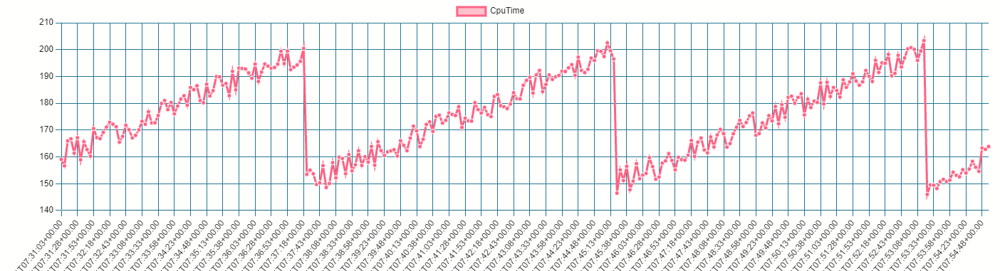
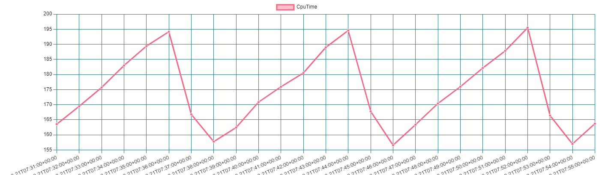

# Metering with TimescaleDB
This is a sample project that demonstrates how TimescaleDB can be effectively utilized to store infrastructure metering data (time-series data). The project is built using the **.NET Core** framework along with **Entity Framework Core** to showcase the integration of these technologies.

## Data Generation and Aggregation
In this project, we demonstrate the process of generating and aggregating metering data using TimescaleDB's capabilities. Here's an overview of the process:

* **Metering Data (Raw Data) Storage:** The raw metering data is stored in the `ApiUsages` table. This table serves as the initial repository for the generated data.
* **Sample Data Generation:** We generate sample data at a regular interval of 5 seconds and insert it into the `ApiUsages` table. This simulated data provides a foundation for the subsequent processes.
* **Different Customer Patterns:** Two distinct customer patterns are represented in the data: `Cust1` and `Cust2`. Their data follows different patterns over time. Specifically, the data for `Cust1` exhibits a *"Square"* pattern, while the data for `Cust2` follows a *"SawTooth"* pattern.
* **Aggregation Process:** Raw data for both customers is aggregated into 1-minute intervals. The average values of these intervals are calculated and inserted into the `ApiUsageSummaryMinutely` table.

The efficacy of TimescaleDB's features is exemplified in the creation of materialized views and continuous aggregates, enabling efficient data processing and management.

Feel free to explore and adapt the concepts presented in this repository to your own projects, and leverage the power of TimescaleDB for managing time-series data effectively.

## Setting Up

1.  Run TimescaleDB instance in a docker container  
    ```sh
    docker pull timescale/timescaledb-ha:pg14-latest
    docker run -d --name timescaledb -p 5432:5432 -e POSTGRES_PASSWORD=password timescale/timescaledb-ha:pg14-latest
    ```
    > Note: you can connect and test the Database using **Azure Data Studio**: [microsoft-doc](https://learn.microsoft.com/en-us/sql/azure-data-studio/download-azure-data-studio?view=sql-server-ver16&tabs=redhat-install%2Credhat-uninstall)

2.  Create tables  
    Unfortunately `dotnet ef database update` doesn't work due to materialize view creation not being a transactional query.
    Until I find a solution, Create tables by:  
    **Running the sql script:** `\Migrations\Raw\Up.sql`
    > Note: You can you **Azure Data Studio** for this

3.  Now Build and **Run the application**. Sample data will be added in the background (wait a few minutes)  
    *  View Raw data
        ```sql
        SELECT  "Time"
                ,"CpuTime"
        FROM public."ApiUsages"
        WHERE "ContextIdentifier" = 'Cust2'
        ORDER BY "Time" DESC;
        ```
    *  View Aggregated data
        ```sql
        SELECT  "Time"
                ,"CpuTime"
        from public."ApiUsageSummaryMinutely"
        WHERE "ContextIdentifier" = 'Cust2'
        ORDER BY "Time" DESC;
        ```

### Charts
*   Raw Data of `Cust2`
    
*   Aggregated data of `Cust2`
    